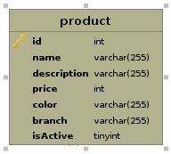

A micro application with one table in database.

### APIs
- GET /products
  + branch: query string param to filter products by branch 
  + name: query string param to filter products by name, using search mysql full text 
  + maxPrice/minPrice: query string param to filter products by price 
  + sortBy: sort result with given field 
  + sortDirection: ASC|DESC sort result with given direction 
- GET /products/:id

### Database schema



## Requirements
### Tools
- docker
- docker-compose

### OS
- linux
- MacOS

### Libraries / Services
- NestJS framework
- Mysql database
- typeorm 
- RabbitMQ

### Design pattern
- Composite pattern
- Clean Architect pattern

## App flow


## Install app

Run command 
```shell
git clone --recursive git@github.com:nguyentruongtuan/icommerce.git
```

Then cd to folder icommerce and run 
```shell
docker-compose up -d
```

Then just wait for docker finish the build


## Testing

Some testing curl

```shell
curl http://localhost:3000/products
curl http://localhost:3000/products?name=chair
curl http://localhost:3000/products?minPrice=1000
curl http://localhost:3000/products?name=chair&sortBy=price&sortDirection=DESC
```