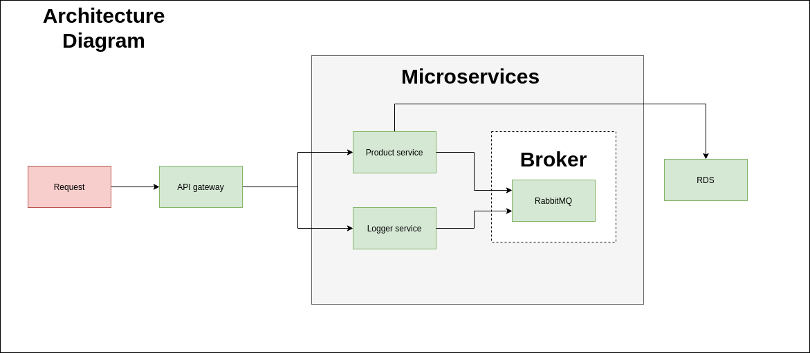

## Requirements
### Tools
- docker
- docker-compose

### OS
- linux
- MacOS

## App flow


## Install app

Run command 
```shell
git clone --recursive git@github.com:nguyentruongtuan/icommerce.git
```

Then cd to folder icommerce and run 
```shell
docker-compose up -d
```

Then just wait for docker build


## Testing

Some testing curl

```shell
curl http://localhost:3000/products
curl http://localhost:3000/products?name=chair
curl http://localhost:3000/products?minPrice=1000
curl http://localhost:3000/products?name=chair&sortBy=price&sortDirection=DESC
```